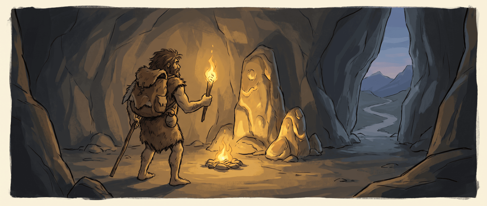

# Caveman



A compression proxy that uses part-of-speech tagging to remove word classes, cutting tokens by about 30% on a
mixed corpus and up to 46% on prose-heavy requests (see [Savings](#savings)).

How it works: [DESIGN.md](docs/DESIGN.md).

## Install

```sh
curl -fsSL https://raw.githubusercontent.com/carlelieser/caveman/main/install.sh | bash
```

## Usage

```sh
caveman claude
```

### Commands

| Command                  | Does                                         |
| ------------------------ | -------------------------------------------- |
| `caveman up`             | Start the proxy in the background            |
| `caveman down`           | Stop it, reporting the session savings       |
| `caveman status`         | Say whether it is running, and on which port |
| `caveman <client> [...]` | Start it if needed, then launch a client     |
| `caveman measure`        | Report savings over the recorded corpus      |

### Levels

`-l` (or `--level`) takes `off`, `light`, `moderate`, or `caveman` — the
default, and the most aggressive. Give it to `up` and every client inherits it;
give it to a client and that launch alone uses it.

```sh
caveman up -l moderate    # every client from now on
caveman claude            # moderate, inherited
caveman claude -l light   # this launch only
caveman claude -l off     # uncompressed, for a baseline
```

Everything after `--` goes to the client untouched, which is how you pass a flag
the CLI would otherwise read as its own: `caveman claude -- -l debug.log`

| Level      | Removes                                                      | "The man has quickly gone to the very large store" |
| ---------- | ------------------------------------------------------------ | -------------------------------------------------- |
| `light`    | determiners                                                  | "man has quickly gone to very large store"         |
| `moderate` | `light` + prepositions, conjunctions, auxiliaries, copulas, pronouns | "man quickly gone very large store"                |
| `caveman`  | `moderate` + adverbs, adjectives                                        | "man gone store"                                   |

Nouns, verbs, numbers, proper nouns, negations and subordinators (`if`,
`unless`, `because`) are never removed at any level.

### Savings

| Level      | Tokens        | Saved  |
| ---------- | ------------- | ------ |
| `light`    | 6,288 → 5,880 | -6.5%  |
| `moderate` | 6,288 → 4,935 | -21.5% |
| `caveman`  | 6,288 → 4,442 | -29.4% |

Savings depend on how much of the request is prose, since code, JSON, and
log lines pass through untouched. At `caveman` level:

| Request                         | Prose | Saved  |
| ------------------------------- | ----- | ------ |
| Rambling bug report             | 99%   | -46.0% |
| Dense prose, no code            | 100%  | -39.3% |
| Six-turn debugging conversation | 98%   | -36.9% |
| Bug report with a stack trace   | 70%   | -27.8% |
| Mostly a pasted diff            | 32%   | -12.8% |
| Terse expert question           | 31%   | -7.2%  |

`caveman measure` to test against corpus.

### Performance

Compression runs at about 160k prose characters a second, which puts a typical
request in this corpus between 1ms and 20ms.

`caveman measure --performance` to test pipeline latency.

## Running without the CLI

The proxy is an ordinary server, so run it and point a client at it yourself:

```sh
go build -o caveman ./cmd/caveman
CAVEMAN_SERVE=1 ./caveman
```

```sh
ANTHROPIC_BASE_URL=http://localhost:8787 \
ANTHROPIC_CUSTOM_HEADERS="X-Caveman-Compress: caveman" \
ENABLE_TOOL_SEARCH=true \
claude
```

## Headers

The CLI sets `X-Caveman-Compress` from `-l` and leaves the other two alone.
Send them yourself to reach what the CLI does not expose.

| Header               | Meaning                                            | Default   |
| -------------------- | -------------------------------------------------- | --------- |
| `X-Caveman-Compress` | `off`, `light`, `moderate`, `caveman`              | `off`     |
| `X-Caveman-Scope`    | Comma list of `messages`, `system`, `tool_results` | `messages, system, tool_results` |
| `X-Caveman-Cache`    | `ignore` or `respect`                              | `ignore`  |

The server defaults to `off` so a client that sends no header forwards
byte-identical; the CLI defaults to `caveman`, since launching through Caveman
is asking for compression. At `off` the CLI sends no header at all rather than
one meaning "do nothing".

Values are case-insensitive and trimmed. A malformed value returns a 400 naming
the header and accepted values; the request never reaches upstream.
Caveman headers are stripped before forwarding.

When compression runs, the response carries `X-Caveman-Tokens-Before`,
`X-Caveman-Tokens-After`, `X-Caveman-Ratio`, and `X-Caveman-Level`.

### Caching

With `X-Caveman-Cache: ignore` Caveman compresses every node the same way no
matter where breakpoints sit, so a node has one compressed form and the cached
prefix keeps hitting once it settles. `respect` skips nodes before the last
`cache_control` breakpoint, which ties a node's output to where that breakpoint
is: when it advances past a node, that node's text flips back to the original
and the prefix misses. `respect` exists to measure the default (see
[DESIGN.md](docs/DESIGN.md#caching)).

## Environment

| Variable                      | Meaning                                     |
| ----------------------------- | ------------------------------------------- |
| `PORT`                        | Listen port, default `8787`                 |
| `CAVEMAN_ANTHROPIC_BASE_URL`  | Redirect the anthropic adapter              |
| `CAVEMAN_UPSTREAM_BASE_URL`   | Redirect every adapter; provider var wins   |
| `DISABLE_LOGS`                | Silence stdout; `0` or `false` keeps it on  |

## Routes

| Route          | Upstream                                    |
| -------------- | ------------------------------------------- |
| `/v1/messages` | `https://api.anthropic.com`, POST over HTTP |
| `/health`      | none; answers `{"service":"caveman","status":"ok"}` |

The `service` name is how the CLI tells Caveman apart from an unrelated process
holding the port, so it will not start over one or stop it.

## Layout

```
cmd/caveman/     the entry point
internal/
  ir/            provider-neutral representation and its walk
  adapters/      wire format ↔ IR, one directory per provider
  compress/      region protection, word classification, the levels
  tagger/        part-of-speech tagging and its generated lexicon
  policy/        header parsing
  server/        request handler, upstream, SSE passthrough, health
  telemetry/     accounting, response headers, savings log, usage
  cli/           commands, daemon, clients, measure
testdata/golden/ the recorded corpus the tests gate against
```

## Tests

```sh
go test ./...
```

Compression is gated against recorded output in `testdata/golden/`. A change
there fails those gates by design, naming every case that moved. If the new
output is correct, record it and review the diff as part of the change:

```sh
go test ./internal/compress/ -update
```

Inputs are never rewritten, and the property tests in `invariants_test.go` are
not regenerable — a change that breaks one is wrong rather than new.
